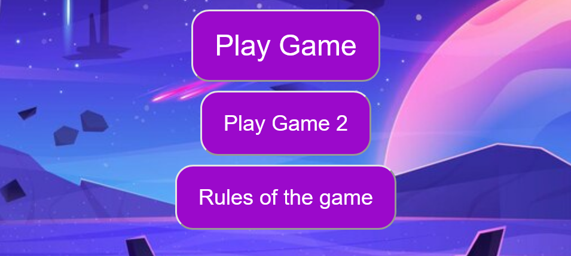
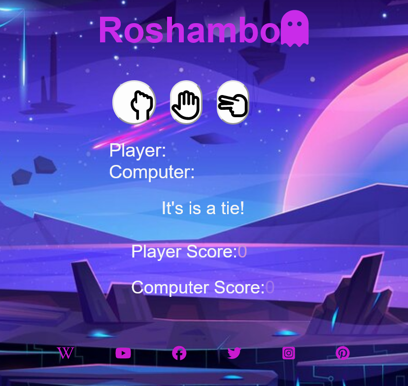
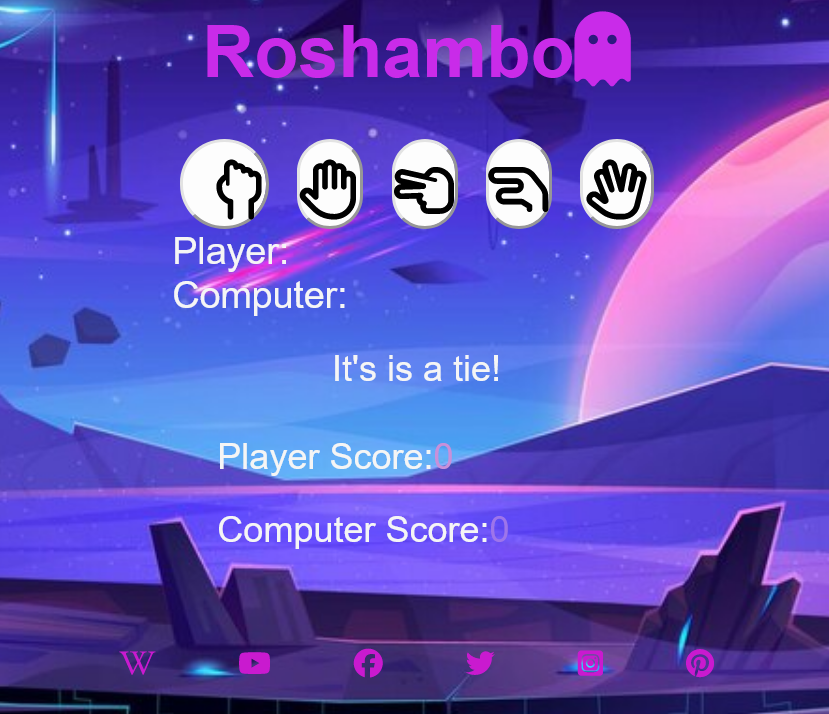
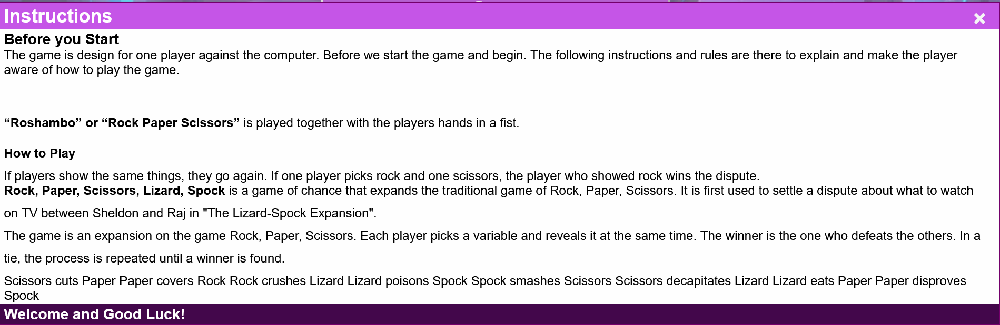
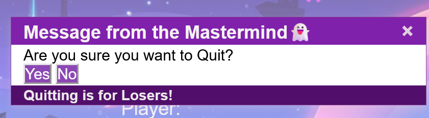
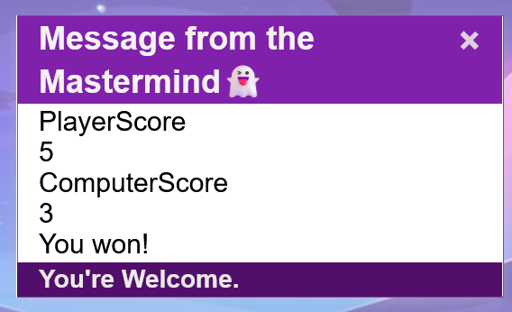
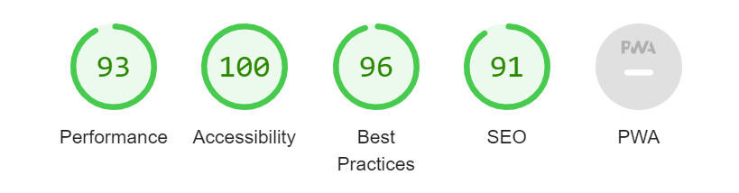

# Come on a adventure!

# The game of ROCK, PAPER, SCISSORS!

The game Rock,paper,sscissors,lizard, spock is a static website about that shows the user a simple,interactive game of rock, paper,scissors,lizard,spock against the computer. Also there is the classical original game with less option but all the same fun.

## Table of Contents

## User Experience

The goal of this website to bring to the user a interactive game. That also make the user hooked for more fun.

## Existing Features:

## The landing page image

### Menu :

Fully responsive menu with the classic version of Rock, paper,scissor that lets the user experience a simple but enjoyable game,subtle for all ages.
The other version is a new version of Rock, paper,scissors, lizard, Spock.Inspired by the series The Big Bang Theory. Where the origin of the new version lies.

# Presentation of the main part:
### Game
Here behind the first button is the original version of Rock,paper,scissors.
A simple but interactive site with the game of Rock, paper, scissors. Urging the user to try the fun himself.

### New Game

The new version of the game with added additional difficulty of two more options: lizard and Spock. Inspired by the American series of The Big Bang Theory. Even more challenging and engaging for the user to try.

#### The original version and the explanation for use:

The rock is a closed fist; paper is a flat hand with fingers and thumb extended and the palm facing downward; and scissors is a fist with the index and middle fingers fully extended toward the opposing player. Rock wins against scissors; paper wins against rock; and scissors wins against paper.

#### The new version with 2 added choices:

The rules are like those of the basic Rock Paper Scissors game, but with 2 extra movements. Scissors cuts paper, paper covers rock, rock crushes lizard, lizard poisons Spock, Spock smashes scissors, scissors decapitates lizard, lizard eats paper, paper disproves Spock, Spock vaporizes rock, and rock crushes scissors.

### Rules

Here are some instruction and explanation on the game and the explanation on how to use or play the games.

### A small message for the winner 

We designed the game that after five rounds, the winner player or the computer the get a quick message. For recognised win or also if they have lost so the player. Also when exiting the game the get a messega. 

# Footer

The footer section includes links to the relevant social media sites for Roshambo. The links will open to a new tab to allow easy navigation for the user. The footer is valuable to the user as it encourages them to keep connected via social media.

### Validator Testing
Validator Testing

HTML
[Validated code on the website: JSGame](https://validator.w3.org/nu/#textarea)

No errors were returned when passing through the official _W3C validator_.

CSS

No errors were found when passing through the official validator _Jigsaw_.

[Validates code for the JSGame](https://jigsaw.w3.org/css-validator/validator)

JavaScript

[Validated  code for the JSGame](https://jshint.com/)

No errors were found when passing through the official validator _JS Hint_.
_The following metrics were returned_:

- There are 18 functions in this file.

* Function with the largest signature take 3 arguments, while the median is 0.

+ Largest function has 15 statements in it, while the median is 2.5.

* The most complex function has a cyclomatic complexity value of 17 while the median is 1.

#  Accessibility 

I check the accessibility of the page through the lighthouse tool.

## Solved Bugs

The user get to five rounds and he wins or loses , there is modal that opens. The modal content should make it possible to read it and after you close it it should reset the score of the player and computer. It dididn't work at first, after we fixed it. 

# Credits
To provide the best visitor experience we also look up for external links.

# Content

Instructions on how to implement form validation on the Sign-Up page were taken from a learning platform: W3SCHOOLS,Blog sites,Newsletter sites and Youtube:

###  W3SCHOOLS

[W3SCHOOL](https://www.w3schools.com/js/default.asp)

####  Newsletter site:Dev,Medium,GeeksforGeeks

Additional resources for information and specific part of JavaScript.

[https://dev.to/tracy4code/how-to-create-a-pop-up-javascript-modal-3652](Dev community)

[https://medium.com/swlh/introduction-to-javascript-basics-cf901c05ca47](Medium Newletter)

[https://www.geeksforgeeks.org/javascript-settimeout-method/?ref=ml_lbp](GeeksforGeeks)

#### Youtube chanels:

Also as additional resource and information or studying. 

* [https://www.youtube.com/results?search_query=bro+code]

- [https://www.youtube.com/@WebDevSimplified](Web Dev Simplified)

+ [https://www.youtube.com/@AniaKubow](Code with Ania Kubow)

* [https://www.youtube.com/@TraversyMedia](Traseversy Media)

- [https://www.youtube.com/@CleverProgrammer](Clever Programmer)

#### Font Awesome:

[Font Awesome](https://fontawesome.com/)

Diverse icons were used from this site.

# Deployment

### The site was deployed to GitHub pages. The steps to deploy are as follows:

In the GitHub repository, navigate to the Settings tab
From the source section drop-down menu, select the Master Branch
Once the master branch has been selected, the page will be automatically refreshed with a detailed ribbon display to indicate the successful deployment.

[Project 2 - game](https://anad30.github.io/project2-js-game/)

[def]: Menu